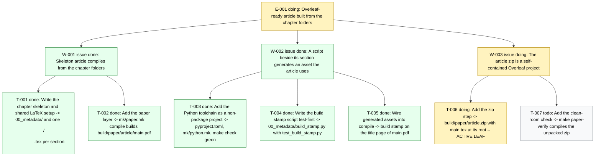

# Board -- surrogate-models
record: local
open path: E-001 > W-003 > T-006   | blocked: 0 | todo roots: 0 | done: 7 | pruned: 0

## Tree

### E-001 [doing] Overleaf-ready article built from the chapter folders

#### W-001 issue [done] Skeleton article compiles from the chapter folders

- T-001 [done] Write the chapter skeleton and shared LaTeX setup -> 00_metadata/ and one <dir>/<dir>.tex per section
- T-002 [done] Add the paper layer -> mk/paper.mk compile builds build/paper/article/main.pdf

#### W-002 issue [done] A script beside its section generates an asset the article uses

- T-003 [done] Add the Python toolchain as a non-package project -> pyproject.toml, mk/python.mk, make check green
- T-004 [done] Write the build stamp script test-first -> 00_metadata/build_stamp.py with test_build_stamp.py
- T-005 [done] Wire generated assets into compile -> build stamp on the title page of main.pdf

#### W-003 issue [doing] The article zip is a self-contained Overleaf project

- T-006 [doing] Add the zip step -> build/paper/article.zip with main.tex at its root   <- ACTIVE LEAF
- T-007 [todo] Add the clean-room check -> make paper-verify compiles the unpacked zip

## Diagram

