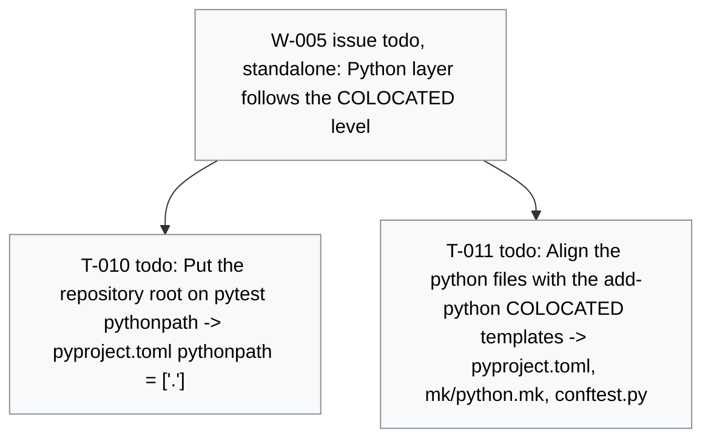

# Board -- surrogate-models
record: local
open path: none   | blocked: 0 | todo roots: 1 | done: 14 | pruned: 0

## Tree

### W-005 issue [todo] (standalone) Python layer follows the COLOCATED level

- T-010 [todo] Put the repository root on pytest pythonpath -> pyproject.toml pythonpath = ["."]
- T-011 [todo] Align the python files with the add-python COLOCATED templates -> pyproject.toml, mk/python.mk, conftest.py

## Closed

### E-001 [done] Overleaf-ready article built from the chapter folders

closed 2026-10-04 -- outcome: One command produces an Overleaf-ready article from the agreed skeleton, including assets generated by scripts. -- ledger: ledgers/E-001.md

#### W-001 issue [done] Skeleton article compiles from the chapter folders

- T-001 [done] Write the chapter skeleton and shared LaTeX setup -> 00_metadata/ and one <dir>/<dir>.tex per section
- T-002 [done] Add the paper layer -> mk/paper.mk compile builds build/paper/article/main.pdf

#### W-002 issue [done] A script beside its section generates an asset the article uses

- T-003 [done] Add the Python toolchain as a non-package project -> pyproject.toml, mk/python.mk, make check green
- T-004 [done] Write the build stamp script test-first -> 00_metadata/build_stamp.py with test_build_stamp.py
- T-005 [done] Wire generated assets into compile -> build stamp on the title page of main.pdf

#### W-003 issue [done] The article zip is a self-contained Overleaf project

- T-006 [done] Add the zip step -> build/paper/article.zip with main.tex at its root
- T-007 [done] Add the clean-room check -> make paper-verify compiles the unpacked zip

#### W-004 issue [done] build/paper/article/ is a clean upload folder

- T-008 [done] Move LaTeX residue out of the upload folder -> build/paper/article/ sources only, PDF at build/paper/article.pdf
- T-009 [done] Verify the upload folder in a clean room -> paper-verify compiles a copy of build/paper/article/

## Diagram

