# Board -- surrogate-models
record: local
open path: E-002   | blocked: 0 | todo roots: 1 | done: 45 | pruned: 1

## Tree

### E-002 [doing] Data audit -- preprocessed datasets behind Sections 2 and 3

#### W-007 issue [done] BH table from the zero-phi0 dataset

- T-014 [done] Add data dependencies and the state home -> pandas + pyarrow, mk/data.mk STATE, CLAUDE.md gate deviation
- T-015 [done] Write the BH preparation test-first -> 30_physical_framework/32_black_holes/prepare_black_holes.py with its tests
- T-016 [done] Wire the BH preparation into make -> local/state/black_holes.parquet

#### W-008 spike [done] How neutron-stars.dat is laid out and how bad runs show up

- T-017 [done] Probe the NS file layout and failure signatures -> local/scratch/probe_neutron_stars.py and Findings on W-008
- T-018 [done] Decide the NS parsing and filtering rules -> spike.decision on W-008

#### W-009 issue [done] NS table from the filtered dataset

- T-019 [done] Write the NS preparation test-first -> 30_physical_framework/33_neutron_stars/prepare_neutron_stars.py with its tests
- T-020 [done] Wire the NS preparation into make -> local/state/neutron_stars.parquet

#### W-010 issue [todo] Frozen split grouped by curve

- T-021 [todo] Write the curve-grouped split test-first -> 50_methodology/51_algorithms/split_datasets.py with its tests
- T-022 [todo] Wire the split into make with its invariant -> local/state/split.parquet, no curve in two sets

#### W-011 issue [todo] Section 3.1 numbers from generated macros

- T-023 [todo] Write the EDA numbers test-first -> 40_data_analysis/41_eda/eda_numbers.py with its tests
- T-024 [todo] Render Section 3.1 from the macros -> 41_eda.tex uses generated numbers and states the EDA scope

#### W-012 bug [done] BH parser fails on repeated block headers and blank lines   (filed during T-016)

- T-025 [done] Record the repeated-header case as a failing test -> test_prepare_black_holes.py RED
- T-026 [done] Skip repeated headers and blank lines in parse_table -> prepare_black_holes.py GREEN

#### W-019 spike [todo] Which preprocessing, targets and split each dataset's EDA supports

- T-046 [todo] Decide the NS decisions rows with the developer -> NS part of W-019 spike.decision
- T-047 [todo] Decide the BH decisions rows with the developer -> BH part of W-019 spike.decision

#### W-020 issue [todo] Section 4.3 preprocessing and feature decisions tables

- T-048 [todo] Write the NS decisions table -> 40_data_analysis/43_preprocessing/43_preprocessing.tex
- T-049 [todo] Write the BH decisions table -> 40_data_analysis/43_preprocessing/43_preprocessing.tex

### E-003 [doing] Paper config, shared plot style and the per-dataset EDA figures

#### W-013 issue [done] Section choices loaded from paper.toml

- T-027 [done] Add pydantic-settings -> pyproject.toml and uv.lock
- T-028 [done] Write the config loader test-first -> shared/config.py with shared/test_config.py
- T-029 [done] Write paper.toml with the plot and NS EDA sections -> paper.toml

#### W-014 issue [done] One paper-wide plot style with a color family per dataset

- T-030 [done] Add matplotlib and seaborn -> pyproject.toml and uv.lock
- T-031 [done] Write the plot style test-first -> shared/plots.py with shared/test_plots.py
- T-032 [pruned] Add the plot section and render a style sample -> paper.toml and local/scratch/style_sample.pdf   [pruned: replaced by the re-plan: the [plot] section moves into T-029 and the visual review happens on the NS and BH EDA figures (T-041, T-045), not a separate sample]

#### W-016 issue [done] Section 4 split into NS EDA, BH EDA, preprocessing decisions and hypotheses

- T-036 [done] Move the existing Section 4 subsections -> 40_data_analysis/41_neutron_stars and 44_hypotheses
- T-037 [done] Add the BH EDA and preprocessing subsections -> 40_data_analysis/42_black_holes and 43_preprocessing

#### W-017 issue [doing] NS EDA figures and numbers selected in paper.toml

- T-038 [done] Write the NS EDA computations test-first -> 40_data_analysis/41_neutron_stars/eda_neutron_stars.py with its tests
- T-039 [done] Draw the NS EDA figures selected in paper.toml -> eda_neutron_stars.py figure functions and main
- T-040 [doing] Wire the NS EDA into make and Section 4.1 -> mk/paper.mk rules and 41_neutron_stars.tex   <- ACTIVE LEAF
- T-041 [todo] Review the NS EDA figures with the developer -> Findings on W-017

#### W-018 issue [todo] BH EDA figures and numbers selected in paper.toml

- T-042 [todo] Write the BH EDA computations test-first -> 40_data_analysis/42_black_holes/eda_black_holes.py with its tests
- T-043 [todo] Draw the BH EDA figures selected in paper.toml -> eda_black_holes.py figure functions and main
- T-044 [todo] Wire the BH EDA into make and Section 4.2 -> mk/paper.mk rules and 42_black_holes.tex
- T-045 [todo] Review the BH EDA figures with the developer -> Findings on W-018

### W-015 issue [todo] (standalone) Paper text for the D floor and the sign symmetry of D   (filed during T-020)

- T-033 [todo] Add the D-floor macros -> eps and the share below it in the Section 3.1 macro output
- T-034 [todo] Restate H1 and the EDA D bullet for the floor -> 42_hypotheses.tex, 41_eda.tex, 61_h1.tex
- T-035 [todo] State the sign symmetry of D in Section 2 -> 30_physical_framework/31_action/31_action.tex

## Closed

### E-001 [done] Overleaf-ready article built from the chapter folders

closed 2026-10-04 -- outcome: One command produces an Overleaf-ready article from the agreed skeleton, including assets generated by scripts. -- ledger: ledgers/E-001.md

#### W-001 issue [done] Skeleton article compiles from the chapter folders

- T-001 [done] Write the chapter skeleton and shared LaTeX setup -> 00_metadata/ and one <dir>/<dir>.tex per section
- T-002 [done] Add the paper layer -> mk/paper.mk compile builds build/paper/article/main.pdf

#### W-002 issue [done] A script beside its section generates an asset the article uses

- T-003 [done] Add the Python toolchain as a non-package project -> pyproject.toml, mk/python.mk, make check green
- T-004 [done] Write the build stamp script test-first -> 00_metadata/build_stamp.py with test_build_stamp.py
- T-005 [done] Wire generated assets into compile -> build stamp on the title page of main.pdf

#### W-003 issue [done] The article zip is a self-contained Overleaf project

- T-006 [done] Add the zip step -> build/paper/article.zip with main.tex at its root
- T-007 [done] Add the clean-room check -> make paper-verify compiles the unpacked zip

#### W-004 issue [done] build/paper/article/ is a clean upload folder

- T-008 [done] Move LaTeX residue out of the upload folder -> build/paper/article/ sources only, PDF at build/paper/article.pdf
- T-009 [done] Verify the upload folder in a clean room -> paper-verify compiles a copy of build/paper/article/

### W-005 issue [done] (standalone) Python layer follows the COLOCATED level

closed 2026-10-04 -- outcome: Given the COLOCATED mechanics of \~/.claude/rules/python.md, When make check runs, Then it passes with the repository root on pytest pythonpath and the python files matching the add-python COLOCATED templates. -- ledger: ledgers/W-005.md

- T-010 [done] Put the repository root on pytest pythonpath -> pyproject.toml pythonpath = ["."]
- T-011 [done] Align the python files with the add-python COLOCATED templates -> pyproject.toml, mk/python.mk, conftest.py

### W-006 issue [done] (standalone) Python dependencies resolve CPU-only for this machine

closed 2026-10-04 -- outcome: Given pyproject.toml, When torch is added with uv, Then it resolves from https://download.pytorch.org/whl/cpu and the lock holds no nvidia, CUDA or triton package. -- ledger: ledgers/W-006.md

- T-012 [done] Pin torch to the PyTorch CPU index -> pyproject.toml [[tool.uv.index]] and [tool.uv.sources]
- T-013 [done] Prove torch resolves CPU-only -> a scratch copy of pyproject.toml locks torch +cpu with no GPU packages

## Diagram

```mermaid
flowchart TD
  E002["E-002 doing: Data audit -- preprocessed datasets behind Sections 2 and 3"]
  E002 --> W007["W-007 issue done: BH table from the zero-phi0 dataset"]
  W007 --> T014["T-014 done: Add data dependencies and the state home -> pandas + pyarrow, mk/data.mk STATE, CLAUDE.md gate deviation"]
  W007 --> T015["T-015 done: Write the BH preparation test-first -> 30_physical_framework/32_black_holes/prepare_black_holes.py with its tests"]
  W007 --> T016["T-016 done: Wire the BH preparation into make -> local/state/black_holes.parquet"]
  E002 --> W008["W-008 spike done: How neutron-stars.dat is laid out and how bad runs show up"]
  W008 --> T017["T-017 done: Probe the NS file layout and failure signatures -> local/scratch/probe_neutron_stars.py and Findings on W-008"]
  W008 --> T018["T-018 done: Decide the NS parsing and filtering rules -> spike.decision on W-008"]
  E002 --> W009["W-009 issue done: NS table from the filtered dataset"]
  W009 --> T019["T-019 done: Write the NS preparation test-first -> 30_physical_framework/33_neutron_stars/prepare_neutron_stars.py with its tests"]
  W009 --> T020["T-020 done: Wire the NS preparation into make -> local/state/neutron_stars.parquet"]
  E002 --> W010["W-010 issue todo: Frozen split grouped by curve"]
  W010 --> T021["T-021 todo: Write the curve-grouped split test-first -> 50_methodology/51_algorithms/split_datasets.py with its tests"]
  W010 --> T022["T-022 todo: Wire the split into make with its invariant -> local/state/split.parquet, no curve in two sets"]
  E002 --> W011["W-011 issue todo: Section 3.1 numbers from generated macros"]
  W011 --> T023["T-023 todo: Write the EDA numbers test-first -> 40_data_analysis/41_eda/eda_numbers.py with its tests"]
  W011 --> T024["T-024 todo: Render Section 3.1 from the macros -> 41_eda.tex uses generated numbers and states the EDA scope"]
  E002 --> W012["W-012 bug done: BH parser fails on repeated block headers and blank lines"]
  W012 --> T025["T-025 done: Record the repeated-header case as a failing test -> test_prepare_black_holes.py RED"]
  W012 --> T026["T-026 done: Skip repeated headers and blank lines in parse_table -> prepare_black_holes.py GREEN"]
  E002 --> W019["W-019 spike todo: Which preprocessing, targets and split each dataset's EDA supports"]
  W019 --> T046["T-046 todo: Decide the NS decisions rows with the developer -> NS part of W-019 spike.decision"]
  W019 --> T047["T-047 todo: Decide the BH decisions rows with the developer -> BH part of W-019 spike.decision"]
  E002 --> W020["W-020 issue todo: Section 4.3 preprocessing and feature decisions tables"]
  W020 --> T048["T-048 todo: Write the NS decisions table -> 40_data_analysis/43_preprocessing/43_preprocessing.tex"]
  W020 --> T049["T-049 todo: Write the BH decisions table -> 40_data_analysis/43_preprocessing/43_preprocessing.tex"]
  E003["E-003 doing: Paper config, shared plot style and the per-dataset EDA figures"]
  E003 --> W013["W-013 issue done: Section choices loaded from paper.toml"]
  W013 --> T027["T-027 done: Add pydantic-settings -> pyproject.toml and uv.lock"]
  W013 --> T028["T-028 done: Write the config loader test-first -> shared/config.py with shared/test_config.py"]
  W013 --> T029["T-029 done: Write paper.toml with the plot and NS EDA sections -> paper.toml"]
  E003 --> W014["W-014 issue done: One paper-wide plot style with a color family per dataset"]
  W014 --> T030["T-030 done: Add matplotlib and seaborn -> pyproject.toml and uv.lock"]
  W014 --> T031["T-031 done: Write the plot style test-first -> shared/plots.py with shared/test_plots.py"]
  W014 --> T032["T-032 pruned: Add the plot section and render a style sample -> paper.toml and local/scratch/style_sample.pdf"]
  E003 --> W016["W-016 issue done: Section 4 split into NS EDA, BH EDA, preprocessing decisions and hypotheses"]
  W016 --> T036["T-036 done: Move the existing Section 4 subsections -> 40_data_analysis/41_neutron_stars and 44_hypotheses"]
  W016 --> T037["T-037 done: Add the BH EDA and preprocessing subsections -> 40_data_analysis/42_black_holes and 43_preprocessing"]
  E003 --> W017["W-017 issue doing: NS EDA figures and numbers selected in paper.toml"]
  W017 --> T038["T-038 done: Write the NS EDA computations test-first -> 40_data_analysis/41_neutron_stars/eda_neutron_stars.py with its tests"]
  W017 --> T039["T-039 done: Draw the NS EDA figures selected in paper.toml -> eda_neutron_stars.py figure functions and main"]
  W017 --> T040["T-040 doing: Wire the NS EDA into make and Section 4.1 -> mk/paper.mk rules and 41_neutron_stars.tex -- ACTIVE LEAF"]
  W017 --> T041["T-041 todo: Review the NS EDA figures with the developer -> Findings on W-017"]
  E003 --> W018["W-018 issue todo: BH EDA figures and numbers selected in paper.toml"]
  W018 --> T042["T-042 todo: Write the BH EDA computations test-first -> 40_data_analysis/42_black_holes/eda_black_holes.py with its tests"]
  W018 --> T043["T-043 todo: Draw the BH EDA figures selected in paper.toml -> eda_black_holes.py figure functions and main"]
  W018 --> T044["T-044 todo: Wire the BH EDA into make and Section 4.2 -> mk/paper.mk rules and 42_black_holes.tex"]
  W018 --> T045["T-045 todo: Review the BH EDA figures with the developer -> Findings on W-018"]
  W015["W-015 issue todo, standalone: Paper text for the D floor and the sign symmetry of D"]
  W015 --> T033["T-033 todo: Add the D-floor macros -> eps and the share below it in the Section 3.1 macro output"]
  W015 --> T034["T-034 todo: Restate H1 and the EDA D bullet for the floor -> 42_hypotheses.tex, 41_eda.tex, 61_h1.tex"]
  W015 --> T035["T-035 todo: State the sign symmetry of D in Section 2 -> 30_physical_framework/31_action/31_action.tex"]
  classDef doing fill:#fff3bf,stroke:#b58900,color:#000;
  classDef blocked fill:#ffe3e3,stroke:#c92a2a,color:#000;
  classDef done fill:#e6ffed,stroke:#2b8a3e,color:#000;
  classDef todo fill:#f8f9fa,stroke:#868e96,color:#000;
  classDef pruned fill:#f1f3f5,stroke:#adb5bd,color:#000;
  class E002,E003,W017,T040 doing
  class W007,T014,T015,T016,W008,T017,T018,W009,T019,T020,W012,T025,T026,W013,T027,T028,T029,W014,T030,T031,W016,T036,T037,T038,T039 done
  class W010,T021,T022,W011,T023,T024,W019,T046,T047,W020,T048,T049,T041,W018,T042,T043,T044,T045,W015,T033,T034,T035 todo
  class T032 pruned
```

