# Board -- surrogate-models
record: local
open path: E-006   | blocked: 2 | todo roots: 4 | done: 186 | pruned: 13

## Tree

### E-006 [doing] Search space and the best surrogate per dataset

#### W-038 issue [pruned] rho_c input check -- raw against log10   [pruned: absorbed by the E-006 search-space re-plan (developer, 2026-10-07): rho_c input form becomes part of the S2 representation screen (W-066)]

#### W-039 issue [pruned] H1 -- log against linear charge target   [pruned: absorbed by the E-006 search-space re-plan (developer, 2026-10-07): log vs linear charge target becomes part of the S2 representation screen (W-066)]

#### W-040 issue [pruned] H2 -- loss x activation at the M_max turning point   [pruned: absorbed by the E-006 search-space re-plan (developer, 2026-10-07): loss x activation becomes part of S4-S5 tuning and precision (W-068)]

#### W-041 issue [pruned] H3a -- model pool GPR, XGBoost, MLP and ResNet   [pruned: absorbed by the E-006 search-space re-plan (developer, 2026-10-07): the model pool becomes the S3 family screen with interpolators added (W-067)]

#### W-042 issue [pruned] H3b -- ripple metric of MLP against ResNet   [pruned: absorbed by the E-006 search-space re-plan (developer, 2026-10-07): the ripple metric becomes a scorecard column for every model (W-065)]

#### W-043 issue [pruned] H3c -- GPR scaling wall   [pruned: absorbed by the E-006 search-space re-plan (developer, 2026-10-07): the GPR scaling wall becomes the data-budget axis of the S3 screen (W-067)]

#### W-064 issue [blocked] Sections 3.1 and 3.2 state the reachable relative error   [blocked since 2026-10-07, waiting on developer: complete; the fast-forward into main waits for the developer's landing approval (with W-071)]

- T-126 [done] Write the data-ceiling functions test-first -> shared/ceilings.py
- T-127 [done] Wire the ceilings into both EDA scripts -> 41_neutron_stars_num.tex and 42_black_holes_num.tex
- T-128 [done] Write paragraph 6 on the reachable error -> 41_neutron_stars.tex and 42_black_holes.tex

#### W-065 issue [todo] One scorecard and a fair harness for every candidate

- T-129 [todo] Write the scorecard test-first -> shared/scorecard.py
- T-130 [todo] Write the fair harness test-first -> shared/harness.py
- T-131 [todo] Move make baseline onto the harness -> build/assets/51_algorithms/51_algorithms_tab_baseline.tex
- T-146 [todo] Describe the search procedure in Section 4.2 -> 50_methodology/52_optimization/52_optimization.tex

#### W-066 issue [todo] Representation screen -- inputs, targets, pointwise or curve-wise

- T-132 [todo] Add the curve-wise representation test-first -> shared/design.py
- T-133 [todo] Run the representation screen -> 60_results/61_representation/61_representation.tex

#### W-067 issue [todo] Family screen -- interpolators, GPR, XGBoost and networks

- T-134 [todo] Write the family factories test-first -> shared/families.py
- T-135 [todo] Run the family screen with successive halving -> 60_results/62_families/62_families.tex

#### W-068 issue [todo] Tuning and precision of the surviving families

- T-136 [todo] Write the equal-budget search test-first -> shared/search.py
- T-137 [todo] Write the precision regime test-first -> shared/surrogate.py
- T-138 [todo] Run tuning and precision on the survivors -> 60_results/63_precision/63_precision.tex

#### W-069 issue [todo] Extrapolation error against the distance from the training hull

- T-139 [todo] Write the distance from the training hull test-first -> shared/scorecard.py
- T-140 [todo] Run the extrapolation probe on the rim and outer curves -> 60_results/64_extrapolation/64_extrapolation.tex

#### W-070 issue [todo] Pareto front and the best approach per pair

- T-141 [todo] Write the Pareto front test-first -> shared/scorecard.py
- T-142 [todo] Run the budget comparison -> 60_results/65_budget/65_budget.tex
- T-143 [todo] State the best approach per pair in the conclusion -> 80_conclusion/80_conclusion.tex

#### W-071 issue [blocked] Section 3.4 and Section 5 follow the search space   [blocked since 2026-10-07, waiting on developer: complete; the fast-forward into main waits for the developer's landing approval]

- T-144 [done] Rewrite Section 3.4 as the search-space question -> 40_data_analysis/44_hypotheses/44_hypotheses.tex
- T-145 [done] Rename and reorder the Section 5 folders -> 60_results/61_representation to 65_budget

### E-007 [todo] Ensemble uncertainty and the final surrogate

#### W-044 spike [pruned] Is L-BFGS fine-tuning worth keeping   [pruned: absorbed by the E-006 search-space re-plan (developer, 2026-10-07): L-BFGS becomes part of the S5 precision regime (W-068)]

#### W-045 issue [todo] Ensemble uncertainty over curve-bootstrap resamples

#### W-046 issue [todo] Final surrogate saved and loadable

### E-008 [todo] Speedup and the MCMC application

#### W-047 spike [todo] Speedup baseline and reference posterior without the solver

#### W-048 issue [pruned] Pareto front of error against inference time   [pruned: absorbed by the E-006 search-space re-plan (developer, 2026-10-07): the Pareto front of error against cost becomes S7 (W-070)]

#### W-049 issue [todo] Mock MCMC recovery with emcee

#### W-050 issue [todo] Surrogate posterior validated against the reference

### E-009 [doing] The paper follows the revised structure, and the release

#### W-051 issue [done] Sections 2.1 to 2.4 written from the revised structure

- T-109 [done] Add Section 2.2's folder and renumber the dataset sections -> 30_physical_framework/32_scalarization, 33_black_holes, 34_neutron_stars
- T-110 [done] Write Section 2.1, the action and field equations -> 30_physical_framework/31_action/31_action.tex
- T-111 [done] Write Section 2.2, the scalarization mechanism -> 30_physical_framework/32_scalarization/32_scalarization.tex
- T-112 [done] Write Section 2.3, the black-hole dataset -> 30_physical_framework/33_black_holes/33_black_holes.tex
- T-113 [done] Write Section 2.4, the neutron-star dataset -> 30_physical_framework/34_neutron_stars/34_neutron_stars.tex

#### W-052 issue [todo] Abstract, introduction, conclusion and title block

#### W-053 spike [done] What the open-source release publishes

- T-119 [done] Write the code and data availability statement -> 00_metadata/metadata.tex and 80_conclusion/80_conclusion.tex

#### W-059 spike [done] Which refs.bib keys the revised structure's citations name

- T-107 [done] Map the numbered citations to refs.bib keys -> 00_metadata/citations.md
- T-108 [pruned] Add the missing references to refs.bib -> 00_metadata/refs.bib   [pruned: superseded: the real references move to the standalone spike W-061 (T-118); W-059 closes on placeholder keys (T-117)]
- T-117 [done] Cite placeholder entries for the missing references -> 00_metadata/refs.bib and the 13 cite markers

#### W-060 issue [done] Title and outline bullets aligned to the revised structure

- T-114 [done] Set the revised title -> 00_metadata/metadata.tex
- T-115 [done] Align the remaining outline bullets to the revised structure -> the todo bullets of 10, 20, 41, 44, 51-53, 61-64, 70, 80
- T-116 [done] Name paper sections by their compiled number in code and make -> mk/, paper.toml, the colocated modules

### W-061 spike [todo] (standalone) Which real references replace the placeholder citations

- T-118 [todo] Replace each placeholder with its real reference -> 00_metadata/refs.bib and 00_metadata/citations.md

### W-072 spike [todo] (standalone) Should fits run as parallel tracked trials, and should Optuna be the registry

- T-148 [todo] Measure the throughput of k one-thread fits -> a probe in local/scratch and a Finding on W-072
- T-149 [todo] Prototype Optuna storage as the run registry -> a probe in local/scratch and a Finding on W-072
- T-150 [todo] Decide the parallelism and the run registry with the developer -> the W-072 spike decision

## Closed

### E-001 [done] Overleaf-ready article built from the chapter folders

closed 2026-10-04 -- outcome: One command produces an Overleaf-ready article from the agreed skeleton, including assets generated by scripts. -- ledger: ledgers/E-001.md

#### W-001 issue [done] Skeleton article compiles from the chapter folders

- T-001 [done] Write the chapter skeleton and shared LaTeX setup -> 00_metadata/ and one <dir>/<dir>.tex per section
- T-002 [done] Add the paper layer -> mk/paper.mk compile builds build/paper/article/main.pdf

#### W-002 issue [done] A script beside its section generates an asset the article uses

- T-003 [done] Add the Python toolchain as a non-package project -> pyproject.toml, mk/python.mk, make check green
- T-004 [done] Write the build stamp script test-first -> 00_metadata/build_stamp.py with test_build_stamp.py
- T-005 [done] Wire generated assets into compile -> build stamp on the title page of main.pdf

#### W-003 issue [done] The article zip is a self-contained Overleaf project

- T-006 [done] Add the zip step -> build/paper/article.zip with main.tex at its root
- T-007 [done] Add the clean-room check -> make paper-verify compiles the unpacked zip

#### W-004 issue [done] build/paper/article/ is a clean upload folder

- T-008 [done] Move LaTeX residue out of the upload folder -> build/paper/article/ sources only, PDF at build/paper/article.pdf
- T-009 [done] Verify the upload folder in a clean room -> paper-verify compiles a copy of build/paper/article/

### E-002 [done] Data audit -- preprocessed datasets behind Sections 2 and 3

closed 2026-10-05 -- outcome: Preprocessed BH and NS tables, a frozen curve-grouped split, and the Section 3.1 numbers rendered from macros, all rebuilt by make from local/initial-data. -- ledger: ledgers/E-002.md

#### W-007 issue [done] BH table from the zero-phi0 dataset

- T-014 [done] Add data dependencies and the state home -> pandas + pyarrow, mk/data.mk STATE, CLAUDE.md gate deviation
- T-015 [done] Write the BH preparation test-first -> 30_physical_framework/32_black_holes/prepare_black_holes.py with its tests
- T-016 [done] Wire the BH preparation into make -> local/state/black_holes.parquet

#### W-008 spike [done] How neutron-stars.dat is laid out and how bad runs show up

- T-017 [done] Probe the NS file layout and failure signatures -> local/scratch/probe_neutron_stars.py and Findings on W-008
- T-018 [done] Decide the NS parsing and filtering rules -> spike.decision on W-008

#### W-009 issue [done] NS table from the filtered dataset

- T-019 [done] Write the NS preparation test-first -> 30_physical_framework/33_neutron_stars/prepare_neutron_stars.py with its tests
- T-020 [done] Wire the NS preparation into make -> local/state/neutron_stars.parquet

#### W-010 issue [done] Frozen split grouped by curve

- T-021 [done] Write the curve-grouped split test-first -> 50_methodology/51_algorithms/split_datasets.py with its tests
- T-022 [done] Wire the split into make with its invariant -> local/state/split.parquet, no curve in two sets

#### W-011 issue [done] Section 3.1 numbers from generated macros

- T-023 [pruned] Write the EDA numbers test-first -> 40_data_analysis/41_eda/eda_numbers.py with its tests   [pruned: superseded: W-017's eda_neutron_stars.py (and W-018's eda_black_holes.py) already generate every Section 3.1 and 3.2 number as macros]
- T-024 [pruned] Render Section 3.1 from the macros -> 41_eda.tex uses generated numbers and states the EDA scope   [pruned: superseded: Section 3.1 was rewritten from the nsEda macros in W-017 (T-054), developer-approved]

#### W-012 bug [done] BH parser fails on repeated block headers and blank lines   (filed during T-016)

- T-025 [done] Record the repeated-header case as a failing test -> test_prepare_black_holes.py RED
- T-026 [done] Skip repeated headers and blank lines in parse_table -> prepare_black_holes.py GREEN

#### W-019 spike [done] Which preprocessing, targets and split each dataset's EDA supports

- T-046 [done] Decide the NS decisions rows with the developer -> NS part of W-019 spike.decision
- T-047 [done] Decide the BH decisions rows with the developer -> BH part of W-019 spike.decision

#### W-020 issue [done] Section 4.3 preprocessing and feature decisions tables

- T-048 [done] Write the NS decisions table -> 40_data_analysis/43_preprocessing/43_preprocessing.tex
- T-049 [done] Write the BH decisions table -> 40_data_analysis/43_preprocessing/43_preprocessing.tex
- T-062 [done] Generate the Section 3.3 numbers test-first -> 40_data_analysis/43_preprocessing/preprocessing_numbers.py
- T-064 [done] Report raw M everywhere in the BH analysis -> eda_black_holes.py, Sections 3.2 and 3.3

#### W-025 bug [done] Two generated EDA tables overflow the text width   (filed during T-048)

- T-063 [done] Make the generated EDA tables fit the text width -> shared/eda.py booktabs and the table headers

#### W-026 issue [done] BH mass figure shows where the curves leave GR

- T-065 [done] Add the GR inset to the BH mass figure -> eda_black_holes.py and Section 3.2

### E-003 [done] Paper config, shared plot style and the per-dataset EDA figures

closed 2026-10-05 -- outcome: shared/plots.py and shared/config.py give a typed PaperConfig and one dataset-aware plot style; Section 4 holds an NS EDA, a BH EDA, a preprocessing-decisions and a hypotheses subsection; the NS and BH EDA scripts beside their sections write the figures paper.toml selects into build/assets, and make compile includes them. -- ledger: ledgers/E-003.md

#### W-013 issue [done] Section choices loaded from paper.toml

- T-027 [done] Add pydantic-settings -> pyproject.toml and uv.lock
- T-028 [done] Write the config loader test-first -> shared/config.py with shared/test_config.py
- T-029 [done] Write paper.toml with the plot and NS EDA sections -> paper.toml

#### W-014 issue [done] One paper-wide plot style with a color family per dataset

- T-030 [done] Add matplotlib and seaborn -> pyproject.toml and uv.lock
- T-031 [done] Write the plot style test-first -> shared/plots.py with shared/test_plots.py
- T-032 [pruned] Add the plot section and render a style sample -> paper.toml and local/scratch/style_sample.pdf   [pruned: replaced by the re-plan: the [plot] section moves into T-029 and the visual review happens on the NS and BH EDA figures (T-041, T-045), not a separate sample]

#### W-016 issue [done] Section 4 split into NS EDA, BH EDA, preprocessing decisions and hypotheses

- T-036 [done] Move the existing Section 4 subsections -> 40_data_analysis/41_neutron_stars and 44_hypotheses
- T-037 [done] Add the BH EDA and preprocessing subsections -> 40_data_analysis/42_black_holes and 43_preprocessing

#### W-017 issue [done] NS EDA figures and numbers selected in paper.toml

- T-038 [done] Write the NS EDA computations test-first -> 40_data_analysis/41_neutron_stars/eda_neutron_stars.py with its tests
- T-039 [done] Draw the NS EDA figures selected in paper.toml -> eda_neutron_stars.py figure functions and main
- T-040 [done] Wire the NS EDA into make and Section 4.1 -> mk/paper.mk rules and 41_neutron_stars.tex
- T-041 [done] Review the NS EDA figures with the developer -> Findings on W-017
- T-052 [done] Compare split strategies on the NS table test-first -> split_strategies in eda_neutron_stars.py
- T-053 [done] Add the NS tables and the extending figures selected in paper.toml -> eda_neutron_stars.py and shared/config.py
- T-054 [done] Write the NS insight paragraphs -> 40_data_analysis/41_neutron_stars/41_neutron_stars.tex

#### W-018 issue [done] BH EDA figures and numbers selected in paper.toml

- T-042 [pruned] Write the BH EDA computations test-first -> 40_data_analysis/42_black_holes/eda_black_holes.py with its tests   [pruned: superseded by the developer's re-plan of 2026-10-05: the shared EDA core is extracted first (T-055) and the BH computations are re-briefed to the BH-specific analysis (T-056)]
- T-043 [done] Draw the BH EDA figures selected in paper.toml -> eda_black_holes.py figure functions and main
- T-044 [done] Wire the BH EDA into make and Section 4.2 -> mk/paper.mk rules and 42_black_holes.tex
- T-045 [done] Review the BH EDA figures with the developer -> Findings on W-018
- T-055 [done] Extract the dataset-agnostic EDA core -> shared/eda.py with shared/test_eda.py
- T-056 [done] Write the BH EDA computations test-first -> 40_data_analysis/42_black_holes/eda_black_holes.py with its tests
- T-057 [done] Write the BH insight paragraphs -> 40_data_analysis/42_black_holes/42_black_holes.tex

#### W-022 bug [done] The NS EDA make rule targets a file the script no longer writes   (filed during T-044)

- T-058 [done] Point the NS EDA rule at its numbers file -> mk/paper.mk

#### W-023 bug [done] Python bytecode caches are tracked in git   (filed during T-057)

- T-059 [done] Untrack and delete the bytecode caches -> a tree without __pycache__

### E-004 [done] The paper builds for Overleaf upload and section-by-section review

closed 2026-10-06 -- outcome: build/assets/ grouped by section with each figure's PNG and wrapper sharing a stem; make overleaf filling build/paper/overleaf/ (flat, plus overleaf.zip) and listing the files added and removed since the last upload; make sections writing one PDF per section with references resolved through the full build; build/paper/article.pdf stays the whole paper. -- ledger: ledgers/E-004.md

#### W-031 issue [done] build/ grouped by section

- T-070 [done] Write each section's assets into its own folder test-first -> both EDA modules and preprocessing_numbers.py
- T-071 [done] Add make assets and move LaTeX residue to build/.work -> mk/paper.mk

#### W-032 issue [done] make overleaf keeps a drag-and-drop Overleaf project in sync

- T-072 [done] Diff the upload folder against the last upload test-first -> 00_metadata/overleaf_upload.py
- T-073 [done] Wire make overleaf -> mk/paper.mk, build/paper/overleaf/ and overleaf.zip

#### W-033 issue [done] One PDF per section with references resolved

- T-074 [done] Write the section entry files test-first -> 00_metadata/section_entry.py
- T-075 [done] Wire make section and make sections -> mk/paper.mk and build/paper/sections/

### E-005 [done] Baseline surrogate through one shared pipeline

closed 2026-10-07 -- outcome: make baseline fits the four dataset x target pairs with live per-epoch progress and writes the Section 5.1 baseline table (test and fold MARE beside the mean and nearest-curve references), the NS mass parity figure, the charge MARE rebuilt with the true and the predicted mass, and one diagnostics folder per run under local/state/51_algorithms/. -- ledger: ledgers/E-005.md

#### W-034 issue [done] NS mass baseline runs end to end with live feedback

- T-076 [done] Add torch and skorch -> pyproject.toml and uv.lock
- T-077 [done] Write the design-matrix contract test-first -> shared/design.py with shared/test_design.py
- T-078 [done] Write the estimator, metrics and training callbacks test-first -> shared/surrogate.py with shared/test_surrogate.py
- T-079 [done] Add the baseline settings to paper.toml -> a typed methodology section in shared/config.py
- T-080 [done] Write the baseline fit script and make baseline -> build/assets/51_algorithms/
- T-090 [done] Restore the best epoch's weights at early stopping -> shared/surrogate.py
- T-091 [done] Print the baseline error macros in scientific notation -> 50_methodology/51_algorithms/fit_baseline.py

#### W-035 issue [done] Each baseline run leaves a diagnostics folder

- T-081 [done] Write the run record test-first -> shared/runs.py with shared/test_runs.py
- T-082 [done] Write the loss curve and the error CDF test-first -> shared/diagnostics.py with shared/test_diagnostics.py
- T-083 [done] Write the worst and median curve overlays test-first -> shared/diagnostics.py
- T-084 [done] Wire the diagnostics into the baseline run -> local/state/51_algorithms/<run>/
- T-092 [done] Flag a run made from uncommitted code -> shared/runs.py and fit_baseline.py

#### W-036 issue [done] Baseline table for four pairs with fold scores and reference predictors

- T-085 [done] Write the reference predictors test-first -> shared/surrogate.py
- T-086 [done] Run the four pairs with fold scores -> build/assets/51_algorithms/51_algorithms_tab_baseline.tex
- T-087 [done] Add the four-pair baseline table to Section 5.1 -> 50_methodology/51_algorithms/51_algorithms.tex
- T-120 [done] Measure fit throughput by thread count and parallel fits -> a probe in local/scratch and a Finding on W-036
- T-121 [done] Train on one torch thread by default -> a threads setting in paper.toml and fit_baseline.py
- T-125 [done] Record W-063 and the re-plan of E-006 to E-008 -> .board/

#### W-037 issue [done] Charge rebuilt with the true and the predicted mass

- T-088 [done] Write the charge rebuild test-first -> shared/surrogate.py
- T-089 [done] Write the charge MARE with true and predicted mass -> 51_algorithms_num.tex and Section 5.1

#### W-054 issue [done] A running fit is visible live from the developer's terminal

- T-093 [done] Write each run's log to its folder -> <run>/train.log and latest.log
- T-094 [done] Log a fit progress line with elapsed and remaining time -> fit_baseline.py
- T-095 [done] Add make follow -> tail the running baseline's log

#### W-055 issue [done] Section 5.1 describes the pipeline and the NS mass baseline

- T-097 [done] Load the baseline numbers only when present -> 00_metadata/article.tex and 51_algorithms.tex
- T-098 [done] Write the Section 5.1 pipeline and baseline text -> 50_methodology/51_algorithms/51_algorithms.tex

#### W-056 issue [done] The epoch table names its time column elapse_s

- T-096 [done] Print the epoch time as elapse_s -> shared/surrogate.py

#### W-057 issue [done] A run tells how far it is, when it may stop and where its outputs go

- T-099 [done] Show k/MAX, epochs since best and the time-left range in the epoch table -> shared/surrogate.py
- T-100 [done] Log a start and an end banner for each run -> 50_methodology/51_algorithms/fit_baseline.py
- T-101 [done] Add make runs and make run -> 50_methodology/51_algorithms/list_runs.py and mk/paper.mk
- T-102 [done] Add make examples, the common commands with examples -> mk/paper.mk
- T-104 [done] Refine the run log from the developer's first look -> shared/surrogate.py and fit_baseline.py
- T-105 [done] Two stop-time columns, the stop criterion on top and a live loss curve -> shared/surrogate.py and fit_baseline.py
- T-106 [done] Print the epoch table at 4 significant figures, elapsed_s to a tenth -> shared/surrogate.py

#### W-062 issue [done] Section 4.1 lists the surrogate pipeline as an algorithm

- T-153 [done] Load the algorithm packages -> 00_metadata/preamble.tex
- T-154 [done] Typeset the pipeline as Algorithm 1 -> 50_methodology/51_algorithms/51_algorithms.tex

#### W-063 issue [done] The charge target keeps every charge, the floor dropped   (filed during T-086)

- T-122 [done] Drop the floor from the charge target test-first -> shared/design.py
- T-123 [done] Restate Section 3.3, H1 and the abstract without the floor -> 40_data_analysis/43_preprocessing/43_preprocessing.tex
- T-124 [done] Rerun the four pairs on the unfloored charge target -> build/assets/51_algorithms/51_algorithms_tab_baseline.tex
- T-147 [done] Checkpoint E-005 and restore the knowledge budget -> .board/board.toml

#### W-073 bug [done] The baseline table scores the charge on the log target, not on the charge D   (filed during T-089)

- T-151 [done] Score the charge rows in D test-first -> 50_methodology/51_algorithms/fit_baseline.py
- T-152 [done] Rerun the four pairs and restate the Section 4.1 comparison in D -> 50_methodology/51_algorithms/51_algorithms.tex

#### W-074 bug [done] The baseline table labels the charge rows Y although they score D   (filed during T-154)

- T-155 [done] Label the charge rows by D test-first -> 50_methodology/51_algorithms/fit_baseline.py
- T-156 [done] Rerun the four pairs with the D label -> build/assets/51_algorithms/51_algorithms_tab_baseline.tex

### W-005 issue [done] (standalone) Python layer follows the COLOCATED level

closed 2026-10-04 -- outcome: Given the COLOCATED mechanics of \~/.claude/rules/python.md, When make check runs, Then it passes with the repository root on pytest pythonpath and the python files matching the add-python COLOCATED templates. -- ledger: ledgers/W-005.md

- T-010 [done] Put the repository root on pytest pythonpath -> pyproject.toml pythonpath = ["."]
- T-011 [done] Align the python files with the add-python COLOCATED templates -> pyproject.toml, mk/python.mk, conftest.py

### W-006 issue [done] (standalone) Python dependencies resolve CPU-only for this machine

closed 2026-10-04 -- outcome: Given pyproject.toml, When torch is added with uv, Then it resolves from https://download.pytorch.org/whl/cpu and the lock holds no nvidia, CUDA or triton package. -- ledger: ledgers/W-006.md

- T-012 [done] Pin torch to the PyTorch CPU index -> pyproject.toml [[tool.uv.index]] and [tool.uv.sources]
- T-013 [done] Prove torch resolves CPU-only -> a scratch copy of pyproject.toml locks torch +cpu with no GPU packages

### W-015 issue [done] (standalone) Paper text for the D floor and the sign symmetry of D

closed 2026-10-05 -- outcome: Given the E-002 D-floor and sign-symmetry Decisions and the Section 3.1 macros, When make compile runs, Then H1, the EDA D bullet and Section 2 state the floor eps, the share of rows below it and the D -> -D symmetry, with no hard-coded number. -- ledger: ledgers/W-015.md

- T-033 [done] Add the D-floor macros -> eps and the share below it in the Section 3.1 macro output
- T-034 [done] Restate H1 and the EDA D bullet for the floor -> 42_hypotheses.tex, 41_eda.tex, 61_h1.tex
- T-035 [done] State the sign symmetry of D in Section 2 -> 30_physical_framework/31_action/31_action.tex

### W-021 issue [done] (standalone) Review markers in the paper with todonotes

closed 2026-10-05 -- outcome: Given the preamble with todonotes, When make compile runs, Then every \todo and every \review note renders inline in its own colour and the upload folder compiles on its own. -- ledger: ledgers/W-021.md

- T-050 [done] Replace the hand-made todo macro with todonotes -> 00_metadata/preamble.tex
- T-051 [done] Add the review note kind and mark the open claims -> preamble.tex and the review notes

### W-024 issue [done] (standalone) Runtime state follows the global local/state rule

closed 2026-10-05 -- outcome: Given the base Makefile with STATE and no local/state Gate deviation, When make clean and then make data run, Then make data rebuilds no state file. -- ledger: ledgers/W-024.md

- T-060 [done] Move STATE into the base Makefile -> Makefile and mk/data.mk
- T-061 [done] Remove the local/state Gate deviation -> CLAUDE.md

### W-027 issue [done] (standalone) make clean runs every area clean, the state included

closed 2026-10-05 -- outcome: Given local/initial-data and a built local/state, When make clean runs, Then local/state is gone and local/initial-data is untouched. -- ledger: ledgers/W-027.md

- T-066 [done] Adopt the area cleans -> Makefile, mk/python.mk and mk/data.mk

### W-028 issue [done] (standalone) Outline text cites stale charge and row numbers

closed 2026-10-05 -- outcome: Given the generated EDA and preprocessing macros, When make compile runs, Then the abstract and Section 2.3 cite the charge range and row counts only through generated macros. -- ledger: ledgers/W-028.md

- T-067 [done] Cite the generated numbers in the abstract and Section 2.3 -> 10_abstract.tex and 33_neutron_stars.tex

### W-029 issue [done] (standalone) Figures render as high-resolution PNG

closed 2026-10-05 -- outcome: Given paper.toml with plot.dpi, When make compile runs, Then every selected EDA figure reaches the PDF as a PNG written at that resolution. -- ledger: ledgers/W-029.md

- T-068 [done] Write the EDA figures as PNG at plot.dpi -> shared/plots.py, both EDA modules, paper.toml

### W-030 issue [done] (standalone) Figures at 450 dpi to keep the paper small

closed 2026-10-05 -- outcome: Given paper.toml with plot.dpi = 450, When make compile runs, Then the figures in build/assets are PNGs written at 450 dpi. -- ledger: ledgers/W-030.md

- T-069 [done] Set plot.dpi to 450 -> paper.toml

### W-058 issue [done] (standalone) Landing settings follow the board tool of 2026-10-06

closed 2026-10-06 -- outcome: Given the board skill's current [landing] keys, When the developer runs make board-status, Then the landing line prints with no [WARN]. -- ledger: ledgers/W-058.md

- T-103 [done] Review [landing] and record the worktree decision -> .board/board.toml

## Diagram

```mermaid
flowchart TD
  E006["E-006 doing: Search space and the best surrogate per dataset"]
  E006 --> W038["W-038 issue pruned: rho_c input check -- raw against log10"]
  E006 --> W039["W-039 issue pruned: H1 -- log against linear charge target"]
  E006 --> W040["W-040 issue pruned: H2 -- loss x activation at the M_max turning point"]
  E006 --> W041["W-041 issue pruned: H3a -- model pool GPR, XGBoost, MLP and ResNet"]
  E006 --> W042["W-042 issue pruned: H3b -- ripple metric of MLP against ResNet"]
  E006 --> W043["W-043 issue pruned: H3c -- GPR scaling wall"]
  E006 --> W064["W-064 issue blocked on developer: Sections 3.1 and 3.2 state the reachable relative error"]
  W064 --> T126["T-126 done: Write the data-ceiling functions test-first -> shared/ceilings.py"]
  W064 --> T127["T-127 done: Wire the ceilings into both EDA scripts -> 41_neutron_stars_num.tex and 42_black_holes_num.tex"]
  W064 --> T128["T-128 done: Write paragraph 6 on the reachable error -> 41_neutron_stars.tex and 42_black_holes.tex"]
  E006 --> W065["W-065 issue todo: One scorecard and a fair harness for every candidate"]
  W065 --> T129["T-129 todo: Write the scorecard test-first -> shared/scorecard.py"]
  W065 --> T130["T-130 todo: Write the fair harness test-first -> shared/harness.py"]
  W065 --> T131["T-131 todo: Move make baseline onto the harness -> build/assets/51_algorithms/51_algorithms_tab_baseline.tex"]
  W065 --> T146["T-146 todo: Describe the search procedure in Section 4.2 -> 50_methodology/52_optimization/52_optimization.tex"]
  E006 --> W066["W-066 issue todo: Representation screen -- inputs, targets, pointwise or curve-wise"]
  W066 --> T132["T-132 todo: Add the curve-wise representation test-first -> shared/design.py"]
  W066 --> T133["T-133 todo: Run the representation screen -> 60_results/61_representation/61_representation.tex"]
  E006 --> W067["W-067 issue todo: Family screen -- interpolators, GPR, XGBoost and networks"]
  W067 --> T134["T-134 todo: Write the family factories test-first -> shared/families.py"]
  W067 --> T135["T-135 todo: Run the family screen with successive halving -> 60_results/62_families/62_families.tex"]
  E006 --> W068["W-068 issue todo: Tuning and precision of the surviving families"]
  W068 --> T136["T-136 todo: Write the equal-budget search test-first -> shared/search.py"]
  W068 --> T137["T-137 todo: Write the precision regime test-first -> shared/surrogate.py"]
  W068 --> T138["T-138 todo: Run tuning and precision on the survivors -> 60_results/63_precision/63_precision.tex"]
  E006 --> W069["W-069 issue todo: Extrapolation error against the distance from the training hull"]
  W069 --> T139["T-139 todo: Write the distance from the training hull test-first -> shared/scorecard.py"]
  W069 --> T140["T-140 todo: Run the extrapolation probe on the rim and outer curves -> 60_results/64_extrapolation/64_extrapolation.tex"]
  E006 --> W070["W-070 issue todo: Pareto front and the best approach per pair"]
  W070 --> T141["T-141 todo: Write the Pareto front test-first -> shared/scorecard.py"]
  W070 --> T142["T-142 todo: Run the budget comparison -> 60_results/65_budget/65_budget.tex"]
  W070 --> T143["T-143 todo: State the best approach per pair in the conclusion -> 80_conclusion/80_conclusion.tex"]
  E006 --> W071["W-071 issue blocked on developer: Section 3.4 and Section 5 follow the search space"]
  W071 --> T144["T-144 done: Rewrite Section 3.4 as the search-space question -> 40_data_analysis/44_hypotheses/44_hypotheses.tex"]
  W071 --> T145["T-145 done: Rename and reorder the Section 5 folders -> 60_results/61_representation to 65_budget"]
  E007["E-007 todo: Ensemble uncertainty and the final surrogate"]
  E007 --> W044["W-044 spike pruned: Is L-BFGS fine-tuning worth keeping"]
  E007 --> W045["W-045 issue todo: Ensemble uncertainty over curve-bootstrap resamples"]
  E007 --> W046["W-046 issue todo: Final surrogate saved and loadable"]
  E008["E-008 todo: Speedup and the MCMC application"]
  E008 --> W047["W-047 spike todo: Speedup baseline and reference posterior without the solver"]
  E008 --> W048["W-048 issue pruned: Pareto front of error against inference time"]
  E008 --> W049["W-049 issue todo: Mock MCMC recovery with emcee"]
  E008 --> W050["W-050 issue todo: Surrogate posterior validated against the reference"]
  E009["E-009 doing: The paper follows the revised structure, and the release"]
  E009 --> W051["W-051 issue done: Sections 2.1 to 2.4 written from the revised structure"]
  W051 --> T109["T-109 done: Add Section 2.2's folder and renumber the dataset sections -> 30_physical_framework/32_scalarization, 33_black_holes, 34_neutron_stars"]
  W051 --> T110["T-110 done: Write Section 2.1, the action and field equations -> 30_physical_framework/31_action/31_action.tex"]
  W051 --> T111["T-111 done: Write Section 2.2, the scalarization mechanism -> 30_physical_framework/32_scalarization/32_scalarization.tex"]
  W051 --> T112["T-112 done: Write Section 2.3, the black-hole dataset -> 30_physical_framework/33_black_holes/33_black_holes.tex"]
  W051 --> T113["T-113 done: Write Section 2.4, the neutron-star dataset -> 30_physical_framework/34_neutron_stars/34_neutron_stars.tex"]
  E009 --> W052["W-052 issue todo: Abstract, introduction, conclusion and title block"]
  E009 --> W053["W-053 spike done: What the open-source release publishes"]
  W053 --> T119["T-119 done: Write the code and data availability statement -> 00_metadata/metadata.tex and 80_conclusion/80_conclusion.tex"]
  E009 --> W059["W-059 spike done: Which refs.bib keys the revised structure's citations name"]
  W059 --> T107["T-107 done: Map the numbered citations to refs.bib keys -> 00_metadata/citations.md"]
  W059 --> T108["T-108 pruned: Add the missing references to refs.bib -> 00_metadata/refs.bib"]
  W059 --> T117["T-117 done: Cite placeholder entries for the missing references -> 00_metadata/refs.bib and the 13 cite markers"]
  E009 --> W060["W-060 issue done: Title and outline bullets aligned to the revised structure"]
  W060 --> T114["T-114 done: Set the revised title -> 00_metadata/metadata.tex"]
  W060 --> T115["T-115 done: Align the remaining outline bullets to the revised structure -> the todo bullets of 10, 20, 41, 44, 51-53, 61-64, 70, 80"]
  W060 --> T116["T-116 done: Name paper sections by their compiled number in code and make -> mk/, paper.toml, the colocated modules"]
  W061["W-061 spike todo, standalone: Which real references replace the placeholder citations"]
  W061 --> T118["T-118 todo: Replace each placeholder with its real reference -> 00_metadata/refs.bib and 00_metadata/citations.md"]
  W072["W-072 spike todo, standalone: Should fits run as parallel tracked trials, and should Optuna be the registry"]
  W072 --> T148["T-148 todo: Measure the throughput of k one-thread fits -> a probe in local/scratch and a Finding on W-072"]
  W072 --> T149["T-149 todo: Prototype Optuna storage as the run registry -> a probe in local/scratch and a Finding on W-072"]
  W072 --> T150["T-150 todo: Decide the parallelism and the run registry with the developer -> the W-072 spike decision"]
  classDef doing fill:#fff3bf,stroke:#b58900,color:#000;
  classDef blocked fill:#ffe3e3,stroke:#c92a2a,color:#000;
  classDef done fill:#e6ffed,stroke:#2b8a3e,color:#000;
  classDef todo fill:#f8f9fa,stroke:#868e96,color:#000;
  classDef pruned fill:#f1f3f5,stroke:#adb5bd,color:#000;
  class E006,E009 doing
  class W064,W071 blocked
  class T126,T127,T128,T144,T145,W051,T109,T110,T111,T112,T113,W053,T119,W059,T107,T117,W060,T114,T115,T116 done
  class W065,T129,T130,T131,T146,W066,T132,T133,W067,T134,T135,W068,T136,T137,T138,W069,T139,T140,W070,T141,T142,T143,E007,W045,W046,E008,W047,W049,W050,W052,W061,T118,W072,T148,T149,T150 todo
  class W038,W039,W040,W041,W042,W043,W044,W048,T108 pruned
```

